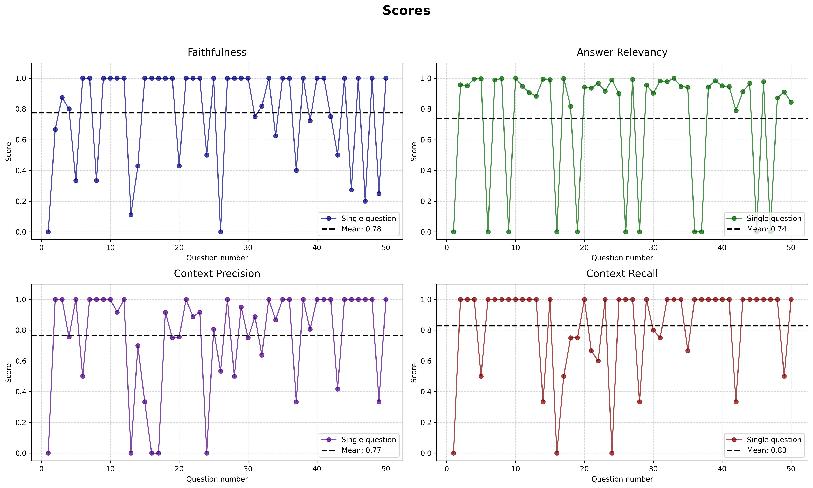
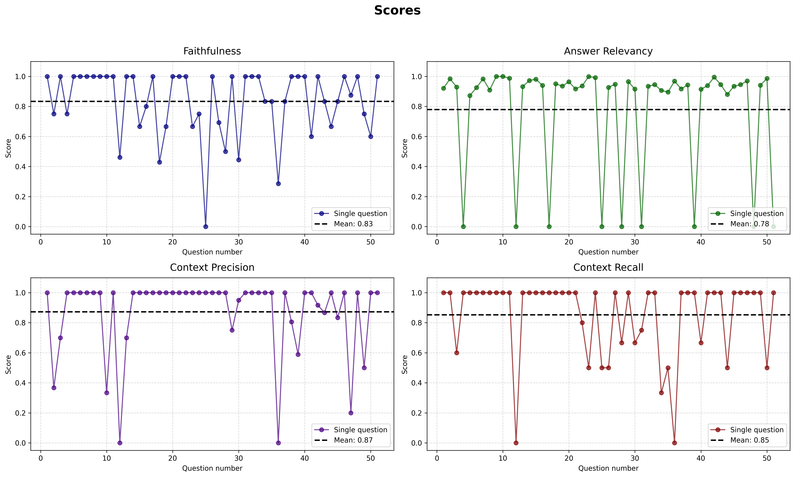
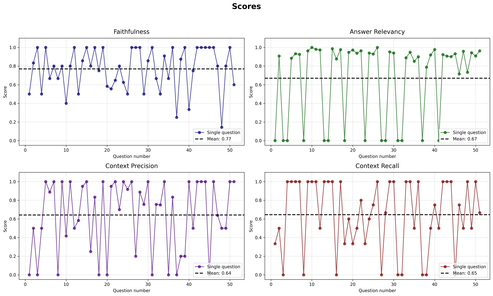
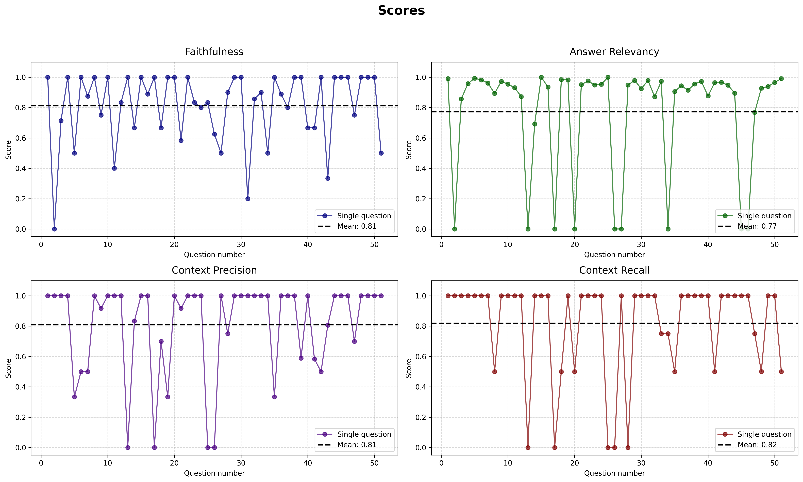
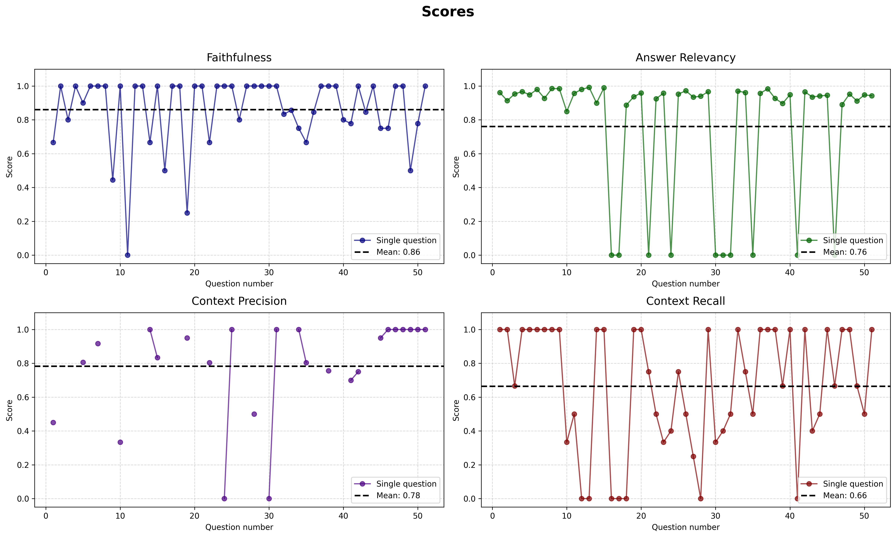

# Local RAG system with automated evaluation
Containerized RAG pipeline using **LangChain**, **FastAPI** and local **Phi-3-mini**. Features **PyMuPDF** data pipeline with custom filtering and deduplication. Leveraged **ChromaDB (MMR)** and **sentence-transformers** for retrieval. Integrated **Ragas** for automated evaluation and **LangSmith** for performance monitoring.
## How to run
1. **Setup environment**:
   Create a `.env` file with your keys:
   ```text
   OPENAI_API_KEY=your_key
   LANGCHAIN_API_KEY=your_key
2. **Launch with Docker**
   ```text
   docker-compose up --build -d
   
Access UI at: http://localhost:8501  

Access API at: http://localhost:8000

3. **Run evaluation**:
   ```text
   docker-compose exec evaluation python evals.py

## Evaluation results
Scores for 5 different books
### RL book

### ML book

### DL book

### LBDL book

### DLM book

